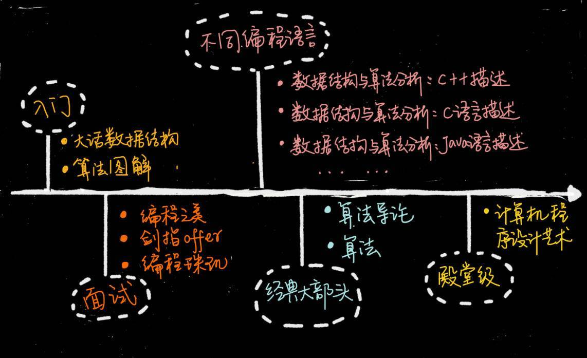
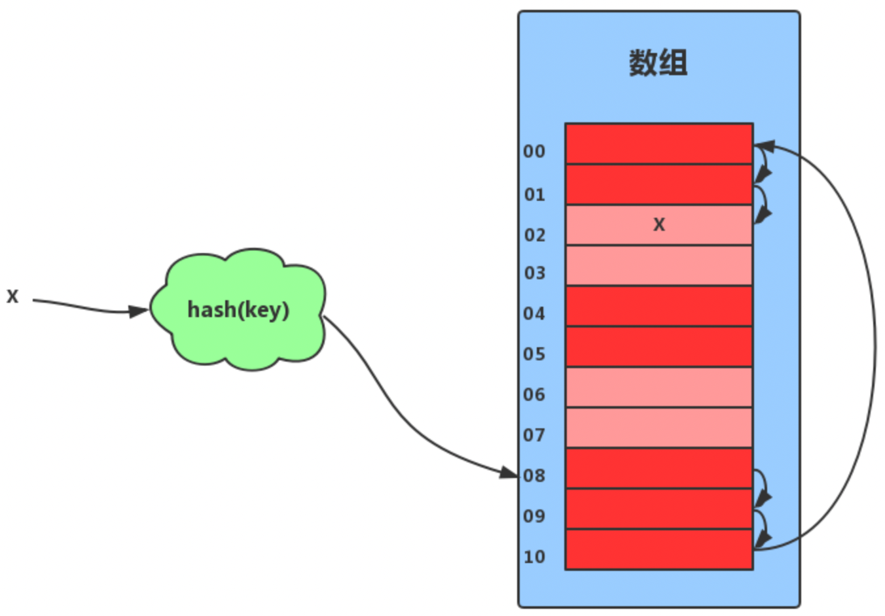
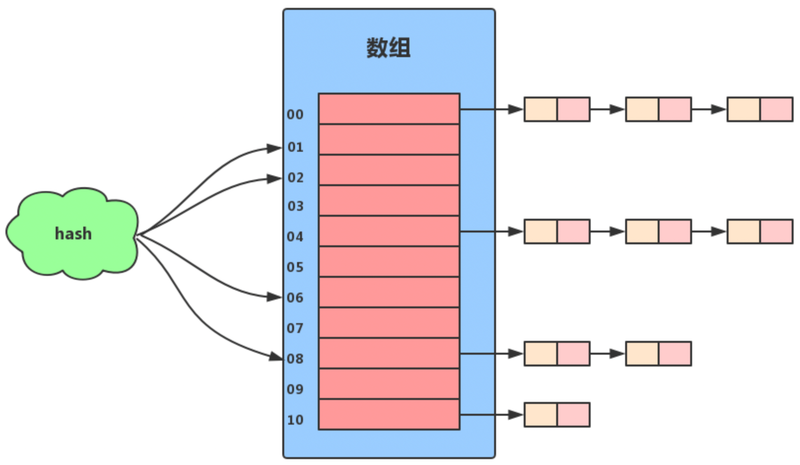

# 数据结构与算法

## 如何学习数据结构与算法

- [如何系统地学习数据结构与算法？](https://zhuanlan.zhihu.com/p/137041568)

## 学习哪些内容

基础： 数组、链表、堆、栈、树、图；排序算法、查找算法；

应用： 堆、栈、队列、B+树、散列表、跳表；LRU 算法、限流算法、

- Java 中的数据结构与算法
- jvm 中的数据结构与算法
- MQ 中的数据结构与算法
- Redis 中的数据结构与算法
- 其他常用算法

## 保持算法敏感度

leetcode 刷题

## 如何准备面试

- 应届毕业生及初级程序员
- Java 中高级程序员

## 概述

- 数据结构概述
  - 什么是数据结构
    - 数据之间的组织形式
  - 存储结构：在计算机中的实际存储结构
    - 顺序存储结构：数据元素存储的位置是连续的，即两个元素之间没有空白存储空间
    - 链式存储结构：数据元素存储的位置是离散的，元素与元素之间可能会存在空白存储空间
    - 两种方式的区别
      - 连续和分散
      - 查找快与慢
      - 增删快与慢
  - 逻辑结构
    - 集合结构（并行关系）：在一块存储空间中，元素与元素之间的关系时散列的，没有其他关系；
    - 线性结构（一对一关系）
    - 树形结构（一对多关系）
    - 图形结构（多对多关系）
- 算法概述
  - 定义：计算机处理问题的步骤
  - 特性
    - 输入
    - 输出
    - 有穷性：算法的步骤是有限的
    - 确定性：总能够得到确定的结果
    - 可行性：在计算机上面是可以运行的
  - 基本要求
    - 正确性：要求所采取的算法的求解结果是正确的
    - 可读性：对人来说是可以理解的
    - 健壮性：对错误的输入也能够得到相对应的结果
    - 时间复杂度：要求所使用的时间尽可能小
    - 空间复杂度：要求所使用的存储空间尽可能小
  - 备注
    - 算法没有最好的，只有最适合的。
- 研究内容
  - 研究一种数据结构时，我们在研究什么？
  - 我们在研究：
    - 存储在计算机中的逻辑结构
    - 操作集

## 线性结构（重点）

- 数组
  - 存储图示
  - 基本使用
    - 创建
    - 获取长度
    - 访问元素
    - 遍历
    - 修改
    - 往不可变数组中添加一个元素
      - 需要创建一个原来的数组长度+1 长度的新数组
    - 删除
      - 创建一个原来数组长度-1 长度的新数组
  - 面向对象的数组（创建、删除、修改、增加、显示、遍历等）
  - 查找算法
    - 线性查找
    - 二分法查找（BinarySearch）：对已知顺序的数组进行排序
- 栈
  - 存储图示（一个木桶，先进后出）
  - 操作集
    - push
    - pop
    - 查看栈顶元素 peek
    - 判断栈是否为空
- 队列
  - 存储图示（先进先出）
  - 操作集
    - 入队
    - 出队
    - 判空
- 单链表
  - 存储图示
  - 操作集
    - next
    - isLast
    - getData
    - 追加
    - 删除下一个节点
    - 插入一个新节点
- 循环链表
  - 存储图示
  - 操作集
    - 与单链表相似
- 双链表
  - 存储图示
  - 操作集
    - after
- 递归
  - 斐波那契数列
  - 汉诺塔

## 排序算法

- 概述
  - 算法的优劣
    - 事后统计法
    - 事前分析估算法
  - 时间复杂度
    - 语句频度：T(n)
    - 一般情况下，算法中的基本操作语句的重复执行次数是问题规模 n 的某个函数，用 T(n)表示，若有某个辅助函数 f(n)，使得当 n 趋近于无限大时，T(n)/f(n)的极限为不等于 0 的常数，则称 f(n)是 T(n)的同数量级函数。记作 T(n)=O(f(n))，称 O(f(n))为算法的渐进时间复杂度，简称时间复杂度。
    - 平均时间复杂度
    - 最坏情况时间复杂度（研究重点）
  - 空间复杂度
- 排序算法
  - 交换排序 - 冒泡排序 - 快速排序
    p22
  - 插入排序
    - 直接插入排序
    - 希尔排序
  - 选择排序
    - 简单选择排序
    - 堆排序
  - 归并排序
  - 基数排序
- 对比

## 树结构

- [树](https://javaguide.cn/cs-basics/data-structure/tree.html#%E4%BA%8C%E5%8F%89%E6%A0%91%E7%9A%84%E5%88%86%E7%B1%BB)

## 哈希表

### 背景

早期计算机的存储是连续存储的，查找起来只需要顺序遍历然后一个一个比对即可。但是如果存放的数据没有规律，并且还是按照顺序存储的方式进行存放，这时想要查询一个数据时，压根不知道存放的位置是多少。于是人们就想，能不能根据要存放的内容，设计一种算法，根据算法就可以知道位置？

于是人们首先想如何让存放的内容跟地址有所绑定呢？此时出现了散列算法以及散列算法的冲突解决算法。

散列算法以及散列算法的冲突解决算法完美解决了存放内容与地址的绑定关系，但是人们又开始分析：如何解决 hash 冲突，空间利用率，引入装载因子……

其他内容：

- 扩容与缩容的过程
- 散列函数的选择
- 装载因子的选择

### 基本原理

#### 散列函数——解决长变短的问题

一些文章介绍散列表的时候，直接贴出一个概念，说散列算法就是将一个数组映射成固定长度的算法。这种说法直接套用了数学的概念，相当于把数学中的函数的概念引了进来。这样说倒也合理。

那有哪些散列函数呢？

- 直接定址法
- 数字分析法
- 平方取值法
- 折叠法
- 除留余数法
- 随机数法
- ……

这些散列函数都具有两个特点：

- 确定性： 对同一个值，散列函数运算多次的结果都是一样的，也就是说同一个值的散列运算结果是确定的；
- 不确定性： 对同一个运算结果，对应的原始输入可能有多个，也就是说同一个运算结果，它的原始输入是不确定的；

这里老王带你体会一个，然后再举一反三，这些散列函数都大差不差，本质都一样。我们拿除留余数法举例。我们先对一块区域进行编号，编号为 1 到 10，现在有 1k 个数据，那么编号为 245 的数据应该存放到哪个位置呢？我们就用 245%10 = 5，结果就是编号为 245 的数据应该存放到地址为编号 5 的位置。现在又有一个编号为 385 的数据，那这个数据的存放地址呢？同样是 385%10 = 5，一样存放到地址为编号 5 的位置。

上面这个例子中 245%10=5， 不管它运算多少次，结果都是 5，这就是它的确定性；而 385%10 也是等于 5 的，说明对于同一个运算结果 5， 它的原始输入可能不一样，这就是不确定性。

其实上面这些散列函数都是这样一个效果，具体选择哪一种算法，要看具体的业务场景，具体来分析。而除留余数法是最好理解的，举一反三。

245 和 385 经过运算之后结果都是 5，这就说明有了冲突。那我们应该怎么解决冲突呢，往下看……

#### 散列冲突及空间结构（Hash 冲突）——解决散列冲突的问题

散列冲突是指不同的输入经过散列运算后，可能会有同一个输出。目前最常见的是两种：

一种是开放寻址，说白了，就是先运算出一个地址，如果这个地址上有数据，就往下面一个地址顺移，如果下面一个地址还有数据，那就接着往下顺移……直到找到一个没有数据的位置。这种方式有一个问题，那就是如果这块区域已经满了，就会造成循环寻址的情况。

另一种是拉链法，这种方式是先运算出一个地址，而这个地址并不保存数据，而是保存一个指针或者是引用，这样这个地址上就可以保存多个运算结果一样的数据了。

#### Hash 槽

Hash 槽就是散列表的数组+链表的实现方式中的数组元素所在的位置。可以想象一下 HashMap 的实现原理： HashMap 的数组部分就是 Hash 槽，一个 Hash 槽可以放很多元素，因为这个槽可以拖着一个链表或红黑树。

#### 装载因子

装载因子是散列表的健康状况的指标。装载因子越大，说明存放的数据越多，空闲位置也就越少，散列冲突也就越大，散列表的性能也就越差；相反，装载因子越小，说明空闲位置越少，散列冲突也就越小，散列表的性能也就越好。计算公式如下：

装载因子 = 存放的数据个数 / 散列表的长度

装载因子为大于 0 的数，可以为整数，也可以为小数，也可以大于 1。比如拉链法中同一个地址上保存了很多数据，数据个数可能会远远大于散列表的长度。

#### 扩容与缩容

在实际使用过程时，散列表的长度并不是一成不变的。这就涉及到扩容和缩容，而只要扩容或缩容，就一定涉及到重新计算地址的过程。在 jdk 中的 HashMap 和 Redis 集群中增删节点信息等都涉及到散列表的扩容和缩容，实际上，分布式应用系统中，散列表也是支持高可扩展性的一种常见的数据结构。关于分布式中一致性 hash 算法，可以参考老王的另一篇[文章](../docs/01-notes/01-CS基础/distribute/hash.md)。

### 应用场景

- Java 中的 HashMap 类
- Redis 中的字典数据结构

### 参考

- [Redis 数据结构——字典](https://www.laoyu.site/2018/%E6%8A%80%E6%9C%AF%E5%AE%9E%E8%B7%B5/redis/Redis%E6%95%B0%E6%8D%AE%E7%BB%93%E6%9E%84%E2%80%94%E2%80%94%E5%AD%97%E5%85%B8/)
- java 集合面试题 52 道.pdf

## 图

## B+树

## 红黑树

//todo

## 令牌桶算法

- [5 种限流算法，7 种限流方式，挡住突发流量？](https://mp.weixin.qq.com/s/HQHAbatTZPs8iHBCHkFOTw)

## LRU 算法

## 其他

- [如何系统地学习数据结构与算法？](https://zhuanlan.zhihu.com/p/137041568)

一个算法培训课程的目录，可以用作算法的学习路线

